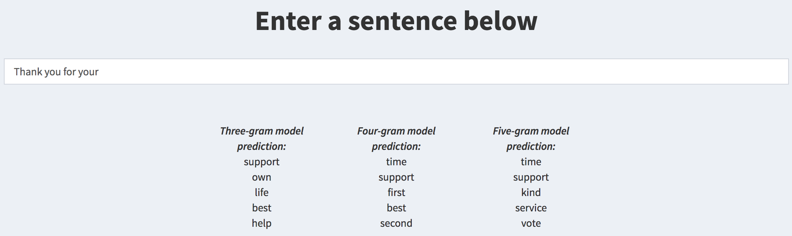

Next Word Prediction App: A Primer
========================================================
author: Kevin Roche
date: 
autosize: true

Background
========================================================

My next word prediction app, available [here,](https://kevinroche22.shinyapps.io/nextWordPredictionApp/) allows users to input a sentence into a text box. The app then outputs the top 5 most probable next words in the users sentence.

To make its prediction, the app uses 3-gram, 4-gram, and 5-gram Stupid Back-Off (SBO) models, where the *n*-gram refers to the number of words the model uses to make its prediction.

The app has been designed to be as intuitive as possible to use - instructions are on the next slide.

App Instructions
========================================================

- **Step 1:** Input a sentence, or part of a sentence, into the text box.
- **Step 2:** The models will calculate the five words most likely to be the next word in that sentence.

How It Works
========================================================

Stupid Back-Off (SBO) models are used to predict the next word in the sentence. SBO's work as follows:

- When trying to predict which word will appear next in a sentence, the model will first look for the context of the word at the n-gram level (in my case, I run 5-gram, 4-gram, and 3-gram models). If there is no n-gram of that size, it will recurse to the (n-1)-gram and multiply its score by 0.4. 
- For example, if I wanted to determine the probability of "you" in the sentence "Hi there, how are you?", the 5-gram model would first see if the 5-gram "Hi there, how are you?" exists. If it didn't, the model would drop the most distant word and try  "there, how are you?", multiplying its score by 0.4 (aka penalizing it). If it still didn't exist, it would then move to the 3-gram level, and so on and so forth.

Model Evaluation
========================================================

To evaluate the model, I split the corpus data into a training set (containing 80% of the data) and a testing set (containing the remaining 20% of the data).

I then trained the model on the training data, and used it to predict the next word in the testing data.

The model was able to predict the next word with ~19% accuracy. Given the ambiguity of the English language, correctly predicting the next word of a sentence 19% of the time is an impressive feat.

Thanks for checking out my product!
